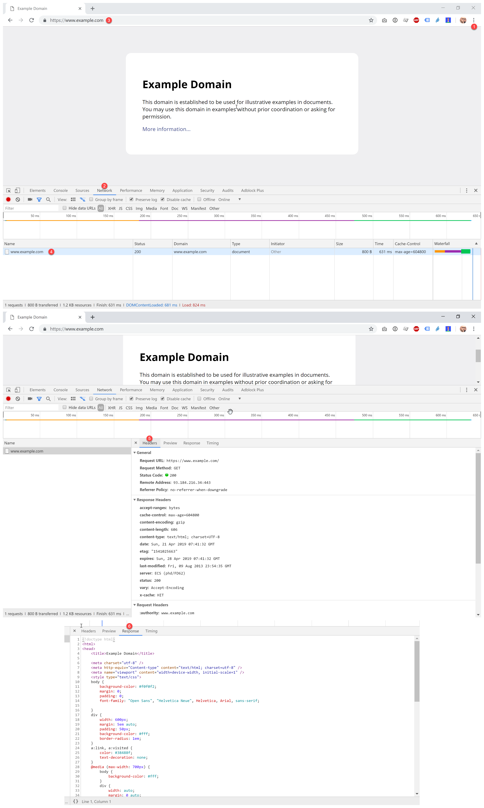
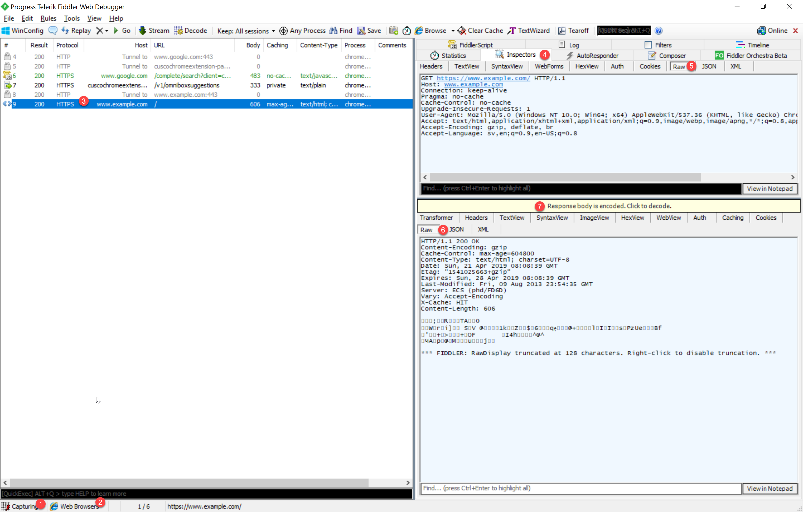

# HTTP

**Mål:** Målet med övningarna är att du ska få en god grundläggande förståelse för HTTP-protokollet och verktyg för att se, analysera och felsöka HTTP-anrop och svar.

## RFC
Bläddra lite i den första beskrivningen av HTTP, protokollet som driver webben. Det är faktiskt inte omöjligt att förstå! 

Alla standarder som förklarar hur internet fungerar publiceras av tradition i dokument som kallas RFC, Request For Comments. i [RFC1945](https://tools.ietf.org/html/rfc1945) beskriver Tim Berners-Lee hur första versionen av protokollet är tänkt att fungera.

Bonus, när du ändå håller på, varför inte kolla in rfc2324 också? 😊

## Telnet

Aktivera Telnet Client på din dator. Googla om du behöver instruktioner.

**Övning:** Göra ett webbanrop till en webbserver.

Kör följande i PowerShell eller i Kommandoraden:

```
telnet example.com 80
```

Klistra in en HTTP Request. Notera att du måste använda menyn, Ctrl+C fungerar inte. Två radbrytningar krävs i slutet för att webbservern ska 

```
GET / HTTP/1.1
Host: example.com

```

Om allt går som det ska får du ett svar tillbaka som liknar det här:

```
HTTP/1.1 200 OK
Accept-Ranges: bytes
Cache-Control: max-age=604800
Content-Type: text/html; charset=UTF-8
Date: Sat, 20 Apr 2019 18:36:31 GMT
Etag: "1541025663"
Expires: Sat, 27 Apr 2019 18:36:31 GMT
Last-Modified: Fri, 09 Aug 2013 23:54:35 GMT
Server: ECS (phd/FD6D)
Vary: Accept-Encoding
X-Cache: HIT
Content-Length: 1270

<!doctype html>
<html>
  ... en massa html taggar ...
</html>
```

Studera svaret. Identifiera statuskoden. Gör ett felaktigt anrop (starta telnet och skriv lite slumpmässigt), vad får du för statuskod då?

Titta på hur Headers är formaterade på samma sätt med `Namn: värde`. Notera hur två tomma rader skiljer alla Headers från själva html dokumentet.

**Instuderingsfrågor:** 
* Vad är en IP-adress? 
* Vad är en port? Vad skiljer dem åt? 
* Hur översätts ett host-namn (t ex www.example.com) till en IP-address?
* Lista några vanliga statuskoder och vad de betyder. Kolla kapitel 9 i RFC1945!
* Statuskoderna är grupperade på hundratal från 1xx till 5xx. Vad betyder varje grupp?
* Vad används header "Host:" till i en request? Varför finns den? Borde det inte räcka med en IP-adress?
* Vad används header "Date:" till i en response?
* Vad används header "Content-Type:" till i en response? Leta reda på några vanliga värden. 
* Vem är Tim Berners-Lee?


### HTTPS
Telnet kan bara användas för att köra http-protokollet. Http använder normalt port 80. När det är https (där det sista s:et betyder secure) används kryptering och då måste man använda ett annat program för Telnet stödjer inte det. Du kan använda **openssl** för det och det går att installera på både Windows, Mac och Linux.

**Övning (överkurs):** 

Installera **openssl** på din dator. Https använder i normala fall port 443. Gör samma anrop igen men denna gång krypterat. 

```
openssl s_client -connect example.com:443
```

Använd samma HTTP Request som för Telnet exemplet ovan och klistra in. Om allt fungerar så ska du se samma svar. 

Notera att enda skillnaden är att kommunikationen är krypterad och inte kan avlyssnas lika lätt. Request och Response ser lika dan ut!

## Browser Developer Tools

Du kan se detaljerna för en request och response i din webbläsare också.

**Övning:** Öppna utvecklingsverktyget i dina webbläsare. Prova att öppna dem i Chrome, Firefox och Edge (på Windows) eller Safari (på Mac).



Öppna utvecklingsverktyget (1), Leta reda på nätverksfliken (2), Skriv in adressen och hämta sidan (3)

Nu ser du alla requests webbläsaren gör i listan. Det första är för webbsidan och ibland kan det vara hundra stycken till för att hämta css, javascript och bilder till sidan. Klicka på den första requesten (4).

När du klickar på en request får du se detaljer. På första fliken ser du request och response headers (4). Jämför dessa värden med när du gjorde det manuellt med Telnet.

Du kan också se response dokumentet (5). 

Gör om samma sak men gå till aftonbladet eller expressen. Kolla mängden requests. Notera vattenfallet i timing när bilder, mm laddas in.

## Fiddler

Installera [Fiddler](https://www.telerik.com/download/fiddler).

**Övning:** Öppna Fiddler. Leta reda på hur du slår på och av *Capture* (1). Med inspelning igång fylls listan snabbt med skräp. Du kan minska mängden genom att bara fånga trafik från webbläsare (2). Ta för vana att slå på Capture precis före du ska diagnostisera något och sedan stänga av det direkt.



Starta Capture och gå till http://www.example.com i en webbläsare. Notera att anropet syns i listan i Fiddler.

När du klickar på en rad i Fiddler (3) ser du detaljer om requesten till höger. Längst upp finns olika verktyg (4). *Statistics* och *Inspector* är intressanta just nu. Du kommer använda *Composer* senare. 

Välj *Inspector* (4) och notera att du i övre halvan ser requesten och i nedre halvan responsen.

Klicka på Raw (5) och se hur GET-kommandot är exakt detsamma som när du använde Telnet tidigare.

Klicka på Raw (6) och se hur du ser samma response headers som tidigare. Response dokumentet är dock oläsbart för att det är komprimerat med zip för att bli mindre. Klicka på den gula raden för att packa upp (7). Nu borde du se även html-delen i Raw fliken.

**Instuderingsfrågor:**
* Hur kan en webbserver veta vilket språk du vill se webbsidan på? Undersök alla request headers, vilken avslöjar detta?
* Hur kan en webbserver veta vilken webbläsare du använder? Gå till https://browscap.org/ua-lookup och se vad som avslöjas om din webbläsare och device.

**Övning:** Aktivera verktyget Composer (4). Dra en request till http://example.com i listan till vänster och släpp i rutan till höger som lyser upp i grönt.

Du kan redigera detaljerna i requesten och sedan trycka Execute för att köra anropet igen. Det här är ett verktyg som kan användas för att manipulera data i formulär för felsökning.

Gå till: http://webdbg.com/sandbox/shop/

Beställ en dator i formuläret och titta på de requests i Fiddler spelar in.

Dra in anropet till checkout.asp i Composer verktyget. Manipulera requesten och ändra beloppet från "Cost=1095.00" till "Cost=1.00" och tryck execute.

Dubbelklicka på det nya anropet till checkout.asp längst ned i listan.- Klicka på fliken WebView i response delen. Grattis! Du har nu beställt en dator för $1 istället för $1095. 

**Övning (överkurs):** Prova att gå till en sida med HTTPS (t ex https://example.com). Ser du den requesten och responsen i Fiddler? 

Aktivera HTTPS debugging i Fiddler i Tools > Options > HTTPS. Slå på Capture och aktivera Decrypt. Svara Ja på en massa säkerhetsdialoger.

Prova nu att gå till en https sajt igen. Du ska nu kunna avlyssna request och response. 

**OBS!** Avlyssningen av krypterad trafik görs genom att Fiddler installerar ett rotcertifikat som du säger åt din dator att lita på de certifikat Fiddler "förfalskar" för sajterna du besöker. Rotcertifikatet möjliggör avlyssning. Många Anti-Virus program gör detsamma för att kunna avlyssna säker trafik. Det är farligt och slår ut många säkerhetsmekanismer på din dator. Efter en avslutad debug-session, stäng alltid av HTTPS Decryption och välj "Remove Interception Certificates" i menyn.


