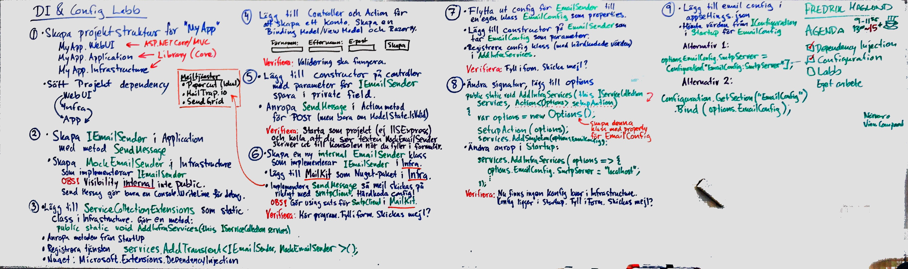

# Configuration and Dependecy Injection

Målet med övningen är att sätta upp en solution med flera olika projekt med Clean Architecture/Onion Architecture och använda Dependency Injection och Configuration management.

Se lösning i [demos/190429-MailDemoWIthDependencyInjecttionAndConfig](demos/190429-MailDemoWIthDependencyInjecttionAndConfig).

