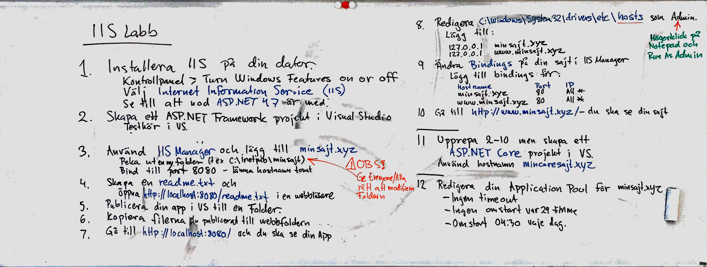

# Deploy till IIS

Målet med övningen är att lära sig driftsätta en webbapplikation till en lokal Internet Information Server (IIS).

Internet Information Services (IIS) är en webbserver som du använder för att köra dina webbapplikationer. Du kan läsa den officiella dokumentationen för att gå djupare. 

## Viktiga filer
Hosts-filen kan används för att översätta host namn (t ex www.minsajt.xyz) till en IP-adress. Operativsystemet kollar här innan den anropar DNS-servern för att slå upp namn vilket innebär att du kan ersätta den konfigurationen med din egen.

Starta Notepad som administratör och öppna filen: _C:\Windows\System32\drivers\etc\hosts_

**OBS!** Använd aldrig 32-bit program (t ex Visual Studio eller Notepad++) för att ändra hosts-filen - det fungerar inte.

**ApplicationHost.config**-filen innehåller konfigurationen för hela webbservern. Vissa av webbserverns inställningar kan också ligga sparade i respektive sajts web.config-fil som har samma format.

Starta Notepad som administratör och öppna filen: _C:\Windows\System32\inetsrv\Config\applicationHost.config_

## IIS Labb
Följ instruktionerna nedan och installera IIS på din dator.  Bygg och driftsätt sedan två egna webbplatser till IIS. 

